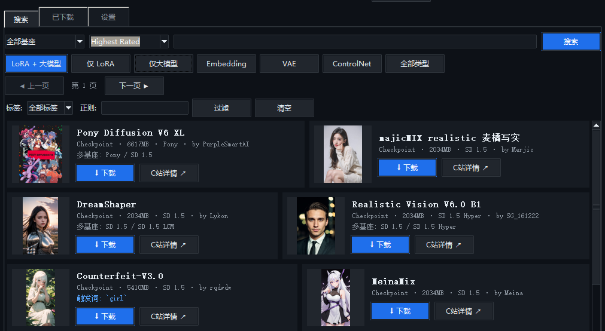

# 🪸 LoRAHoard — Civitai LoRA & 大模型 拉取器

> 囤货不设限，收藏永免费。把 C 站的好模型统统圈进自己地盘（Hoard = 囤积，作者自带 1130+ LoRA 囤货体质）。

免费、开源、零依赖的 **Civitai（C站）模型浏览/下载桌面工具**（作者：@Ne）。

- **基于 Civitai 官方公开 API**（civitai.com / civitai.red 双源直连）
- **永久免费**：无订阅、无付费墙、无云同步、无广告、无远程授权
- 零额外依赖：Python 标准库 + 系统自带 tkinter，单文件，双击启动、桌面窗口，**不用开浏览器**
- 不上传任何数据；API Key 只存本机

## 界面



## 为什么做

自己动手写一个轻量、免费、开源的工具：**只要本体 + 元数据 + 已下载/更新状态**，花哨功能一概不要。
完全基于 Civitai 官方公开 API。

## 免费声明

- 本工具 **完全免费、开源**（MIT License），无任何付费功能、无试用期、无远程服务器授权
- **不收集使用数据**；唯一外联是 Civitai 官方 API
- 源代码完全公开，任何人都可以自由使用、修改、分发

## API 能力（基于 Civitai 官方公开 API v1）

- 搜索/浏览模型：关键词、类型（LORA / Checkpoint / Embedding / VAE / ControlNet…）、**基座**（Anima / Flux / Illustrious / Pony…）、**标签**（风格 / 概念 / 角色 / 服装…）、排序，cursor 翻页
- 模型详情与全部版本（**多基座选择下载**）、下载地址 `api/download/models/{id}`
- 封面小图（CDN）
- **双源一键切换**：civitai.com（需梯子）/ civitai.red（国内镜像直连）
- 下载本体 `.safetensors` / `.ckpt`（需登录 / NSFW 的模型填 API Key）

## 功能（轻量，自用够用）

1. **搜索 / 浏览** —— 启动即自动加载热门模型；左侧下拉选**基座（大模型类型）**：Anima / Flux / Illustrious / Pony / SD 1.5…（API 原生 baseModels 过滤，只出该基座模型）；关键词搜 C 站模型，支持 **LoRA / 大模型(Checkpoint) / Embedding / VAE / ControlNet** 等类型（分类快捷按钮一键切换）
   （封面 + 名字 + 下载量 + 触发词，**两列网格、每页 12 个**——不足 12 会自动补拉几轮，实在没有就少显示；翻页浏览，**基座/排序/标签下拉选中即生效**（不用点搜索），标签并入服务端搜索与 基座/类别/关键词 叠加不冲突，+ 可选正则客户端叠加匹配 标签/标题/触发词）
2. **下载** —— 一键下载本体（实时进度），**点下载先弹一个小框**：
   - **版本/基座下拉**：同一 LoRA 适配多种大模型（SDXL / Pony / Illustrious / Flux…）时，列出全部版本（名字·基座·大小），**选哪个下哪个**，分支自动跟随所选基座
   - 再确认「分支+用途」→ 自动落盘到 `分支-用途` 目录：LoRA（画风）→ `loras/Anima-style`，Checkpoint → `checkpoints/Anima-style`（**LoRA 和大模型分开对比**）
   - 下载即打标签（类别/分支/用途/关键词），更新检测按所选版本走，ComfyUI 递归扫描子目录直接可用
3. **元数据** —— 同时保存 JSON（名字/触发词/描述/作者/版本/versionId）
4. **已下载标记** —— 搜索卡片上直接标 **✓ 已下载**。识别三层：
   - 本工具下载过的 → 按 model id 精确匹配
   - 带 C站/ComfyUI-Manager 的 `<同名>.metadata.json` sidecar（你现有收藏 78% 都有）→ 按 sidecar 里的 modelId 精确匹配
   - 都没有 → 按文件名（+大小 ±10% 或 safetensors 头部训练输出名）兜底，标「✓ 已下载?」表示可能是
5. **更新检测** —— 本地 versionId ≠ C站最新版本时标 **🔄 有更新**（sidecar 里的也能查），一键更新下载
6. **已下载** —— 本地列表，按目录分组，覆盖整个 models 根（含你 loras 下的主题子目录）；行内显示**触发词**；**分页浏览（每页 100）** + **「显示封面」开关**（大库存建议关，开了才逐页异步加载小预览图，缓存有上限不爆内存）。**老 Lora 兼容**：没有 sidecar/meta 的旧文件，会读 safetensors 头部补出 名称/基座/触发词（`ss_output_name` / `ss_tag_frequency`），预览图优先用相邻本地图（`<同名>.jpeg` 等，零流量）
7. **标签** —— 给本地收藏打标，四维可叠加（AND 筛选）：
   - **类别**：LoRA / **大模型**(Checkpoint 单独一类) / VAE / Embedding / ControlNet / 其他
   - **分支**：属于哪个大模型，**下拉含 C站原生基座（Anima / Flux / Illustrious / Pony / SD 1.5…）+ 你的主题子目录名**（可手输）
   - **用途**：中文按 **C站官方标签分类**：风格 / 概念 / 角色 / **服装** / 姿势（物体/背景/动作等可手输；**输入中文也能筛选命中**，存储用英文 style/… 目录名不受影响）
   - **关键词**：多个、逗号分隔；**筛选下拉直接选自你打过的便签关键词（不用手输）**，勾选「正则」按正则匹配
   存 `下载目录/_meta/tags.json`，不改动模型文件

## 用法（Windows）

1. 双击 `启动CoralLoRA.bat`（或命令行 `python CoralLoRA_gui.py`）
2. 弹桌面窗口 → 选类型 → 搜索 → 看「✓已下载 / 🔄有更新」标记 → 下载 → 完事

> 默认目录自动找本机 ComfyUI models（当前目录/用户目录下的常见位置）；**首次使用请在「设置」页把下载/扫描目录指到你的 ComfyUI models 根**，
> 保存后写入 config.txt 记住（config.txt 与 api_key.txt 均不入库）。打开就能看到已有的大模型/LoRA 哪些下过、哪些有新版本。
> 旧网页版（`server.py` + `index.html`，localhost:8788）保留可用，但默认仍是旧下载目录，主用桌面版即可。

## 环境要求

- **Python 3.10+**（自带 tkinter，Windows 官方安装包默认包含）
- **Pillow（可选）**：装了封面图 jpeg/webp 都能显示并缩放；没装只显示 PNG 封面，其余功能不受影响
- 无其他依赖，`requests` 都不需要（纯标准库 urllib）
- 平台：Windows 原生支持（双击 bat）；macOS / Linux 用 `python3 CoralLoRA_gui.py` 启动，顶栏「打开目录」按钮自动切换打开方式

## 隐私

- **API Key 只存在本机** `下载目录/api_key.txt`，任何情况下不上传、不入库（`.gitignore` 已忽略）
- **config.txt**（记住你的目录/API 源选择）同样不入库，换机器首次运行会回到默认配置
- 工具只访问 Civitai 官方 API（civitai.com / civitai.red），不收集任何使用数据

## 开源许可

本项目基于 **MIT License** 发布，见 [LICENSE](LICENSE)。

## 配置

| 项 | 方式 |
|---|---|
| **下载/扫描目录** | 默认自动指向 ComfyUI models 根；窗口「设置」页可换，持久化到 `config.txt`；环境变量 `CORAL_LORA_DIR` 优先级最高 |
| **API Key** | 窗口「设置」页里填，或环境变量 `CORAL_LORA_KEY`（下载 NSFW / 登录模型必需） |
| **API 地址** | 默认官方；设置页可一键切 **civitai.red 国内镜像（直连，不烧梯子流量）**，下载地址自动跟随；环境变量 `CORAL_LORA_API` 也可改（持久化在 config.txt） |

Key 只存在本机 `下载目录/api_key.txt`，不上传任何地方。

## 文件

```
CoralLoRA/
├── CoralLoRA_gui.py    # 桌面版：零依赖 Python（tkinter + urllib）
├── screenshot.jpg      # 界面截图
├── config.txt          # 记住你选的下载/扫描目录（自动生成）
├── server.py           # 旧网页版后端（保留）
├── index.html          # 旧网页版前端（保留）
└── 启动CoralLoRA.bat   # Windows 双击启动（默认桌面版）
```

## 已知限制

- 匿名下载部分模型会 401/307（C 站登录要求），填 API key 解决
- 更新检测只对能拿到 modelId/versionId 的模型可靠（工具下载的 meta 或 sidecar）；只剩文件名时只能靠「文件名+大小」猜，标问号
- 下载是串行后台线程，多个同时下会排队（够用就好）
- 封面图显示依赖 Pillow（装了更好，jpeg/webp 都能显示；没装只显示 PNG 封面，其余功能不受影响）
